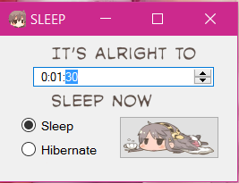

# STOP POSTING AND GO TO SLEEP!

## Screenshot

## Important!
The art (drawings) in this program were not made by me, I googled "kagaposting" and used a picture I liked.

## Description
This is a count down timer app which can hibernate your PC or put it in sleep mode.

## Usage
You can set a time in HH:MM:SS format, and select the suspend mode (either sleep or hibernate).
When you click the button, the countdown will start, and all the controls except the button will
become disabled. When it reaches zero, your PC will enter the selected suspend mode.
You can stop the countdown and enable the controls by pushing the button one more time.

## Changing the button picture
You can drag and drop your favourite kanmusu picture on the form to set it as the button image!
If you drop something that can not be converted into a picture, the button will reset to the default Haruna.
This way you can get back the default Haruna picture by dropping a file on the form that can not be converted into a picture.

**Important!** If you remove/rename the picture, you will get the default Haruna back, because the program only saves the path to the file.
So don't delete/rename/move around the picture that you want to use ;)
(Of course if you move it somewhere else but drag-and-drop it on the form again, it will work again.)

## Download
You can download the whole project, or grab the exe [from this link](https://github.com/atadi96/sleep-count-down/blob/master/SleepCountDown/SleepCountDown/bin/Release/SleepCountDown.exe)

